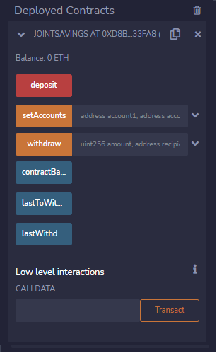
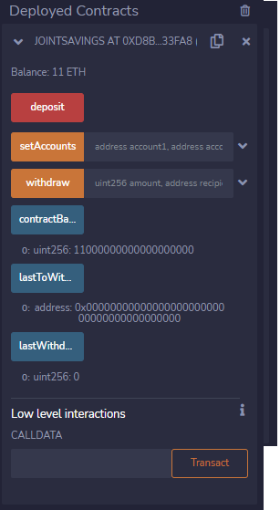
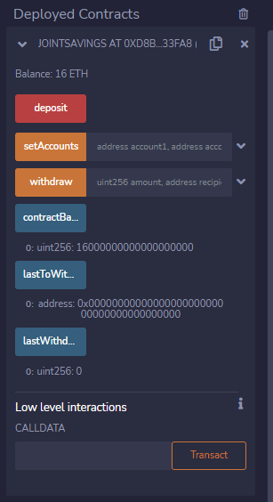
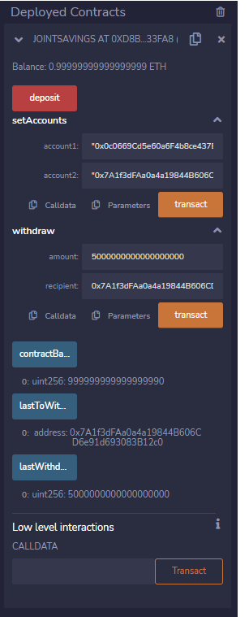

# Joint Savings

# This app is to automate financial transactions using blockchain technology. A solidity smart contract will be created that accepts two addresses that will be able to control the joint account.

